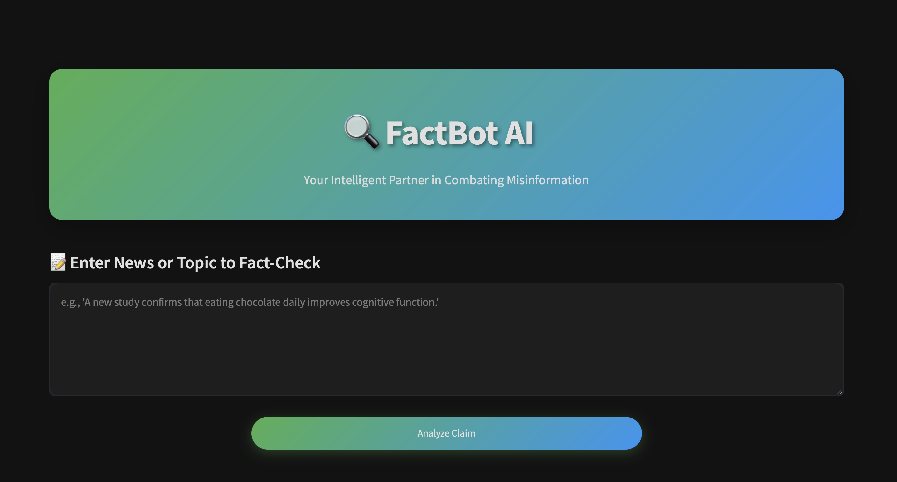

# 🔍 FactBot AI: Your Intelligent Multi-Agent Fact-Checking System


*A glimpse of FactBot AI's intuitive dark-themed interface.*


## 🚀 Overview

Welcome to **FactBot AI**, a sophisticated multi-agent system designed to deliver comprehensive and rapid fact-checking capabilities. Built with the powerful CrewAI framework and presented through an intuitive Streamlit interface, FactBot AI takes a news article or topic as input, processes it through a network of specialized agents, and provides a concise **final verdict**, supported by **verified articles**, detailed **reasoning**, and actionable **recommendations**.

This intelligent application is engineered to bring clarity and accuracy to the information landscape, ensuring you receive well-substantiated insights along with transparency into the verification process.

## ✨ Key Features

* **Intelligent Multi-Agent System:** Leveraging CrewAI, FactBot AI orchestrates a team of specialized AI agents, each focusing on different aspects of fact-checking to ensure thorough and accurate analysis.
* **Comprehensive Output:** For every input, FactBot AI provides:
    * **Final Verdict:** A clear and concise judgment on the veracity of the input news/topic.
    * **Supporting Articles:** Links and summaries of verified sources that underpin the verdict.
    * **Detailed Reasoning:** A transparent explanation of how the verdict was reached, highlighting key findings from the agents.

* **Transparency & Metrics:**
    * **Sources Verified:** Clearly displays the number of external sources consulted and verified by the agents during the fact-checking process.
    * **Execution Time:** Provides the time taken for the entire fact-checking process, demonstrating the efficiency of the multi-agent architecture.
* **User-Friendly Interface:** A sleek, dark-themed Streamlit application designed for ease of use and optimal readability.
* **Rapid Processing:** Experience swift fact-checking, delivering comprehensive results in a minimal timeframe.


## 🛠️ Technical Stack & Dependencies

FactBot AI is built upon robust and modern technologies:

* **Python 3.8+** 🐍: The core programming language.
* **CrewAI**: A cutting-edge Agentic AI Framework that powers the multi-agent architecture.
* **Streamlit** 🌐: Provides the interactive and user-friendly web interface.

To run this project, ensure you have these installed.


## 🔑 API Credentials

FactBot AI relies on external APIs for its comprehensive fact-checking capabilities:

* **LLM Key (e.g., Gemini API Key):** Essential for the language model's reasoning and understanding.
    * Obtain your Gemini API Key by following the [instructions here](https://ai.google.dev/gemini-api/docs/api-key).
* **Serper API Key:** Used for efficient and accurate web searching to gather supporting articles.
    * Create a free account at [Serper.dev](https://serper.dev) to obtain your API key.

Ensure these API keys are configured as environment variables or within a `.env` file for secure access.


## 🚀 Getting Started

Follow these simple steps to set up and run FactBot AI on your local machine:

1.  **Clone the Repository:**
    ```bash
    git clone https://github.com/saikiran1224/FactBot-AI.git
    cd factbot-ai
    ```

2.  **Install Dependencies:**
    ```python
    pip install -r requirements.txt
    ```

3.  **Configure API Keys:**
    Create a `.env` file in the root directory of the project and add your API keys:
    ```
    GEMINI_API_KEY="your_gemini_api_key_here"
    SERPER_API_KEY="your_serper_api_key_here"
    ```
    *Replace `"your_gemini_api_key_here"` and `"your_serper_api_key_here"` with your actual API keys.*

4.  **Run the Application:**
    ```python
    streamlit run main.py
    ```

5.  **Access the App:**
    If not automatically opened, Open your web browser and navigate to `http://localhost:8501`


## 🎨 Interface & Theming

FactBot AI features a carefully designed dark theme for an optimal viewing experience. The theme is configured in `main.py` and can be customized:

* **Primary Color:** `#4CAF50` (A trust-evoking green)
* **Backgrounds:** `#121212` (Main), `#1E1E1E` (Component)
* **Text Colors:** `#E0E0E0` (Light), `#A0A0A0` (Secondary)

Feel free to modify these values to suit your aesthetic preferences.


## 📂 Project Structure

The project is organized into logical components for clarity and maintainability:

* `main.py`: The entry point of the Streamlit application, handling the user interface and interactions.
* `trigger_crew.py`: Contains the core logic for orchestrating the multi-agent fact-checking process using CrewAI.
* `requirements.txt`: List of all Python dependencies required for the project.
* `README.md`: This documentation file.
* `.env`: (Recommended) File for securely storing API keys and other environment variables.


## 🤝 Contributing

We welcome contributions to enhance FactBot AI! If you have suggestions, bug reports, or want to contribute code, please feel free to:

* Submit issues on the GitHub repository.
* Open pull requests with your proposed changes.


## 📜 License

This project is licensed under the MIT License. See the `LICENSE` file in the repository for full details.